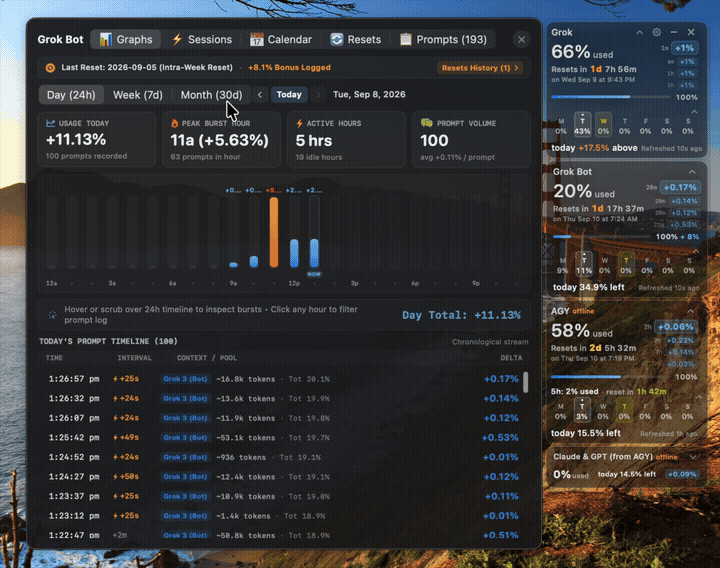

# BigUwidget

Always-on-top **AI usage / quota widget** for **Mac, Linux, and Windows**.

See how much of your weekly (and 5-hour) allowance you have used for:

- **Grok** (grok.com / xAI)
- **Grok Bot** in **Cursor**
- **Antigravity** — Gemini (**AGY**) and **Claude & GPT** from AGY
- **ChatGPT** (optional card)

Unofficial desktop dashboard. Not affiliated with Google, xAI, OpenAI, Anthropic, or Cursor. Quota endpoints can change.

### Demo

[Full video](docs/biguwidget.mp4)

## Platform Status

- 🍏 **macOS** — **Primary & Best Maintained** (native Swift / SwiftUI app, fully tested and actively maintained).
- 🐧 **Linux** — **Best Maintained** (Electron with hardware glassmorphism & seamless sign-in, fully tested and verified).
- 🪟 **Windows** — **Experimental (Community Tested)**. Packaged via Electron, but not personally tested by the maintainer on a native Windows machine. Windows users are welcome to test, report issues, or contribute fixes!

## Download

Latest release: **[v1.1.0](https://github.com/LondonVista/biguwidget/releases/latest)**

| OS | Status | File |
|---|---|---|
| **Mac** | Native App (Recommended) | [BigUwidget-1.1.0-Mac.zip](https://github.com/LondonVista/biguwidget/releases/latest/download/BigUwidget-1.1.0-Mac.zip) |
| **Linux** | Tested & Maintained | [BigUwidget-1.1.0-Linux.zip](https://github.com/LondonVista/biguwidget/releases/latest/download/BigUwidget-1.1.0-Linux.zip) |
| **Windows** | Experimental (Untested) | [BigUwidget-1.1.0-Windows.zip](https://github.com/LondonVista/biguwidget/releases/latest/download/BigUwidget-1.1.0-Windows.zip) |

Mac: unzip and run **Install.command**, or drag `BigUwidget.app` to `/Applications`.  
Linux: Node.js 20+, then `./Start.sh`.  
Windows: Node.js 20+, then `Start.bat`.

## Updates

In **Settings** choose:

- **Prompt** (default) — asks when a new GitHub release is out
- **Auto** — downloads the new zip
- **Off** — no checks

## Support

[ko-fi.com/london_vista](https://ko-fi.com/london_vista)
