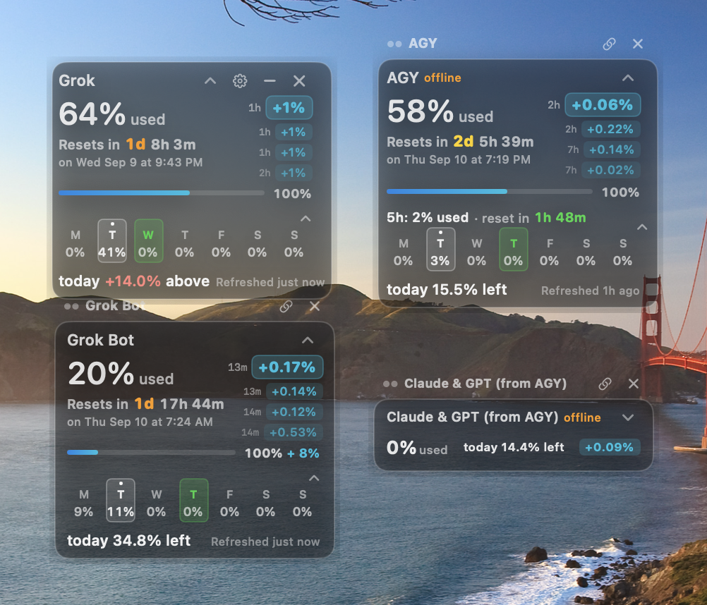

# BigUwidget

Always-on-top **AI usage / quota widget** for **Mac, Linux, and Windows**.

See how much of your weekly (and 5-hour) allowance you have used for:

- **Grok** (grok.com / xAI)
- **Grok Bot** in **Cursor**
- **Antigravity** — Gemini (**AGY**) and **Claude & GPT** from AGY
- **ChatGPT** (optional card)

Unofficial desktop dashboard. Not affiliated with Google, xAI, OpenAI, Anthropic, or Cursor. Quota endpoints can change.

### Demo

https://github.com/LondonVista/biguwidget/raw/main/docs/biguwidget.mp4

## Download

Latest release: **[v1.0.1](https://github.com/LondonVista/biguwidget/releases/latest)**

| OS | File |
|---|---|
| **Mac** (native app) | [BigUwidget-1.0.1-Mac.zip](https://github.com/LondonVista/biguwidget/releases/latest/download/BigUwidget-1.0.1-Mac.zip) |
| **Linux** | [BigUwidget-1.0.1-Linux.zip](https://github.com/LondonVista/biguwidget/releases/latest/download/BigUwidget-1.0.1-Linux.zip) |
| **Windows** | [BigUwidget-1.0.1-Windows.zip](https://github.com/LondonVista/biguwidget/releases/latest/download/BigUwidget-1.0.1-Windows.zip) |

Mac: unzip and run **Install.command**, or drag `BigUwidget.app` to `/Applications`.  
Linux: Node.js 20+, then `./Start.sh`.  
Windows: Node.js 20+, then `Start.bat`.

## Updates

In **Settings** choose:

- **Prompt** (default) — asks when a new GitHub release is out
- **Auto** — downloads the new zip
- **Off** — no checks

## Support

[ko-fi.com/london_vista](https://ko-fi.com/london_vista)
