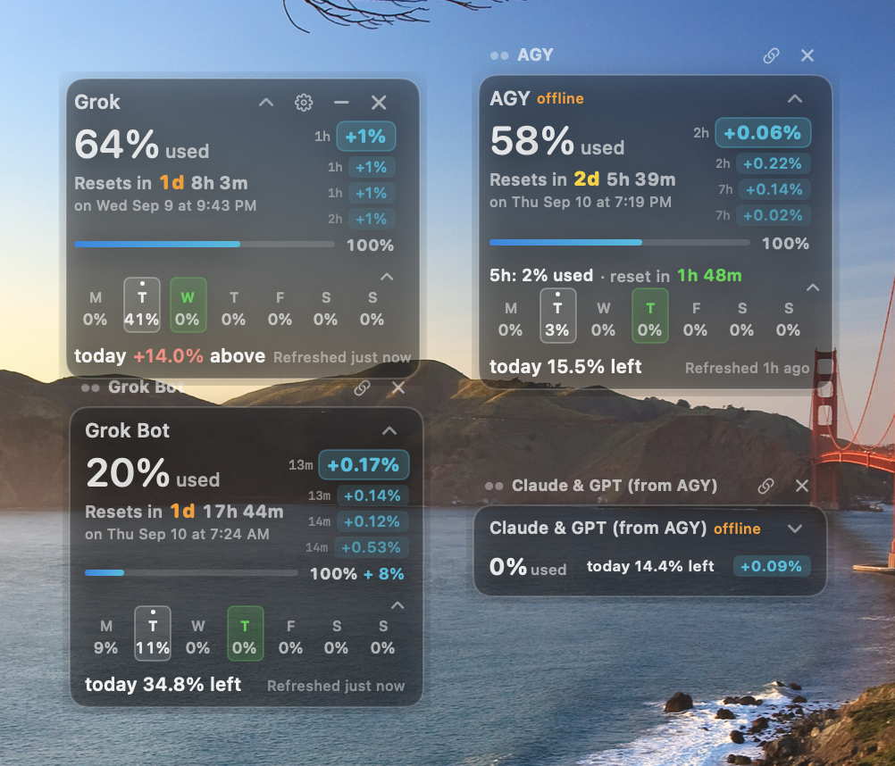
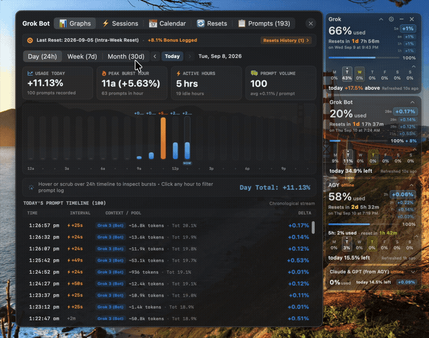

# BigUwidget

Always-on-top **AI usage / quota widget** for **Mac, Linux, and Windows**.

See how much of your weekly (and 5-hour) allowance you have used for:

- **Grok** (grok.com / xAI) — S1
- **Grok Bot** in **Cursor** — S2
- **Antigravity** — Gemini (**AGY**) and **Claude & GPT** from AGY — S3 & S4
- **Claude** — Pro / Max 5-hour and weekly limits from your Claude Code sign-in — S5
- **ChatGPT** (optional card)

Unofficial desktop dashboard. Not affiliated with Google, xAI, OpenAI, Anthropic, or Cursor. Quota endpoints can change.

### Demo

[▶ Full video on X](https://x.com/London_Vista/status/2097908803475742791?s=20)

## Versions (do not mix)

| Platform | Version | Release |
|---|---|---|
| **Mac** (native Swift) | **1.2.10** | [v1.2.10](https://github.com/LondonVista/biguwidget/releases/tag/v1.2.10) |
| **Linux** | **1.2.11** | [v1.2.11](https://github.com/LondonVista/biguwidget/releases/tag/v1.2.11) |
| **Windows** | **1.2.11** | [v1.2.11](https://github.com/LondonVista/biguwidget/releases/tag/v1.2.11) |

## Download

Latest releases: **[v1.2.10](https://github.com/LondonVista/biguwidget/releases/tag/v1.2.10)** (Mac) and **[v1.2.11](https://github.com/LondonVista/biguwidget/releases/tag/v1.2.11)** (Linux & Windows)

| OS | Status | File |
|---|---|---|
| **Mac** | Native App (Recommended) | [BigUwidget-1.2.10-Mac.zip](https://github.com/LondonVista/biguwidget/releases/download/v1.2.10/BigUwidget-1.2.10-Mac.zip) |
| **Linux** | Tested & Maintained | [BigUwidget-1.2.11-Linux.zip](https://github.com/LondonVista/biguwidget/releases/download/v1.2.11/BigUwidget-1.2.11-Linux.zip) |
| **Windows** | Experimental (Untested) | [BigUwidget-1.2.11-Windows.zip](https://github.com/LondonVista/biguwidget/releases/download/v1.2.11/BigUwidget-1.2.11-Windows.zip) |

- **Mac**: open the DMG / zip and drag `BigUwidget` onto **Applications** (or run `Install.command`).
- **Linux**: Node.js 20+, then `./Start.sh`.
- **Windows**: Node.js 20+, then `Start.bat`.

## How it works

BigUwidget has no server and no account of its own. Every few minutes it asks each service for the same usage numbers you would see on that service's own usage page, then draws them as cards. It sends no analytics or telemetry. The only other request it makes is the update check to GitHub.

### Sign-ins and tokens (Mac)

| Card | How it signs in | Where the sign-in is kept | Sent only to |
|---|---|---|---|
| **Grok** | You log in to grok.com in the widget's built-in browser | WebKit cookie store (`~/Library/HTTPStorages`) | grok.com |
| **Grok Bot** | You log in to cursor.com in the built-in browser | WebKit cookie store | cursor.com |
| **AGY / Claude & GPT** | Uses your existing Antigravity / Gemini CLI sign-in. You can also paste a token in Settings | macOS Keychain (item `gemini` / `antigravity`), or the CLI's own file in `~/.gemini` or `~/.config/antigravity` | Google (`cloudcode-pa.googleapis.com`, `oauth2.googleapis.com`) |
| **Claude** | Uses your existing Claude Code sign-in | macOS Keychain (item `Claude Code-credentials`). BigUwidget only reads it | api.anthropic.com |
| **ChatGPT** | You log in to chatgpt.com in the built-in browser | WebKit cookie store | chatgpt.com |

- Passwords are never seen or stored by BigUwidget. You type them into the service's own login page.
- Keychain items are read with the system `security` tool, so macOS asks your permission the first time.
- To sign out of a website card, sign out on that site in the built-in browser. For AGY and Claude, sign out of the CLI itself.

### Local data

Usage history (used for the graphs, the year calendar and reset tracking) is saved as JSON files in `~/Library/Application Support/` (for example `ClaudeUsageWidget/`, `GrokUsageWidget/`, `AGYusageWidget/`). Card order, size and other settings are kept in the app's preferences. Deleting those folders resets the history.

## Updates

In **Settings** choose:

- **Prompt** (default) — asks when a new GitHub release is out
- **Auto** — downloads the new zip
- **Off** — no checks

## Links & Support

